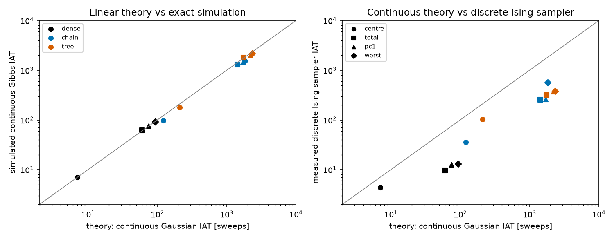
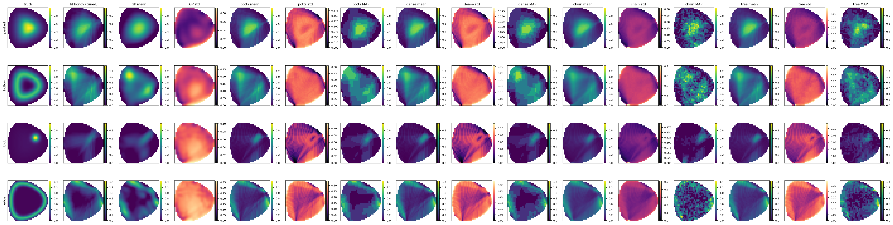
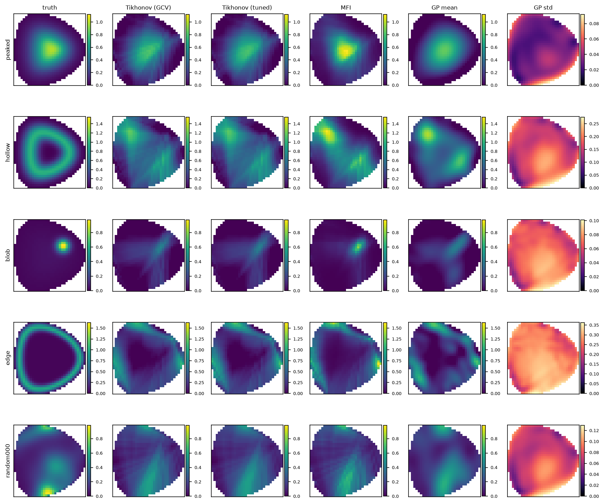
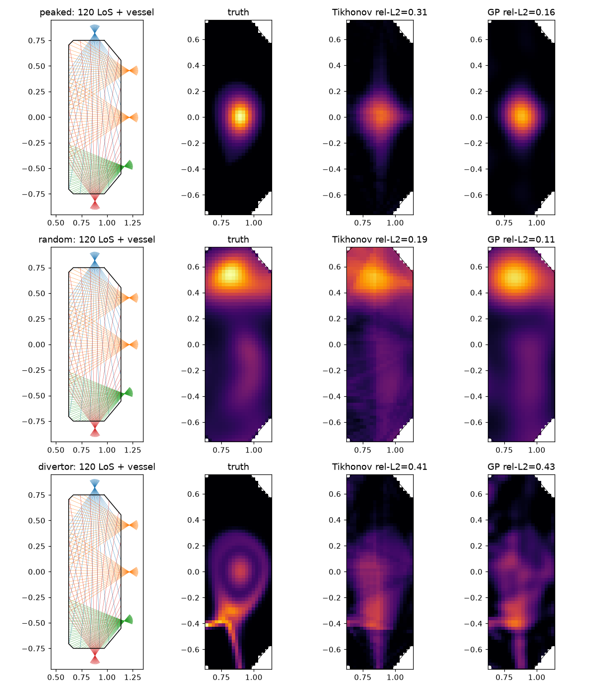

<div align="center">

# plasma-tsu-tomo

**Bayesian tokamak tomography as Boltzmann sampling: what works on probabilistic hardware, and what blocks it**

[](https://github.com/Lulzx/plasma-tsu-tomo/actions/workflows/tests.yml)


[](LICENSE)


</div>

Tokamak control needs radiation profiles in about a millisecond, ideally with uncertainty. Probabilistic (p-bit)
hardware samples Boltzmann distributions natively at femtojoule cost per spin update. That makes Bayesian bolometer
tomography an obvious application.

This repository follows the whole path. It encodes the tomography posterior as a Potts/Ising energy, samples it with
[thrml](https://github.com/extropic-ai/thrml), and builds sparse, hardware-faithful versions of the model. It then
measures and explains what happens at each step, and estimates the energy and latency on Extropic's thermodynamic
sampling unit (TSU).

> Everything runs on a laptop CPU, with synthetic data plus real TCV bolometer geometry. Status: research prototype,
> write-up in progress. A full log of every result is in [`docs/FINDINGS.md`](docs/FINDINGS.md).

## Key findings

1. **A calibrated discrete posterior.** Choosing the smoothness hyperparameter by marginal likelihood calibrates the
   posterior: on random fields, 95% intervals cover 0.95 of pixels, against 0.70 with the discrepancy principle.
   Across 68 problems on two geometries (synthetic, and real TCV), the Potts sampler always converges
   (R-hat ≤ 1.004). Its 95% coverage is 0.80–0.97 on the synthetic geometry and 0.90–0.98 on TCV. Gaussian-process
   tomography drops to 0.55–0.78 on several phantom families.
2. **Honest accuracy.**
   - Over 50 synthetic problems, Potts ties tuned Tikhonov (wins 29 of 50, p = 0.32). It loses to GP (14 of 50) and
     to minimum Fisher information (MFI, 8 of 50).
   - On TCV it beats Tikhonov in 13 of 18 problems, and beats GP on the hollow, blob and edge phantoms.
   - An ablation over 7 problems shows that its gain over the Gaussian posterior comes from **positivity**, not from
     discreteness.
   - MFI is the most accurate method overall.
3. **Bounded-degree exact embeddings (I-chain, I-tree).** These replace the dense line-integral couplings with local
   running partial sums. The likelihood stays exact, as long as a variance-compensation rule is applied.
4. **A mixing barrier, explained.** The embeddings never converge. Linear-Gaussian theory, validated against
   simulation, gives slowest-mode autocorrelation times of 78 sweeps for dense Gibbs, against 11,350 (I-chain) and
   6,900 (I-tree). We prove a structural lower bound: any exact, chord-local, bounded-degree embedding pins pixels
   n_eff times harder than dense Gibbs. Copy-node embedding onto a degree-16 chip fails the same way. No remedy that
   works with binary single-spin updates on a fixed sparse graph closes the gap.

## The problem

```
b = T ε + n,      n ~ N(0, σ²)          72 chord measurements  →  806 unknown pixels   (11× under-determined)
```

Discretise each pixel to K levels and encode the levels as domain-wall (thermometer) bits. The posterior is then
**exactly an Ising model**:

```math
E(x) = \tfrac{1}{2}\lVert (b - \Delta T x)/\sigma \rVert^2 + \tfrac{\lambda\Delta^2}{2}\sum_{\langle j,k\rangle}(x_j-x_k)^2
\;\;\Longrightarrow\;\; E(s) = -\textstyle\sum_i h_i s_i - \sum_{i \lt j} J_{ij} s_i s_j
```

The catch is that $T^\top T$ couples every pair of pixels that share a chord. Spins end up with hundreds to thousands
of neighbours, while hardware wants sparse, local couplings.

## Formulations

| Variant | Idea | Spins | Max degree | Gibbs colours |
|---|---|---:|---:|---:|
| **Potts** | categorical pixel variables, pairwise factors carry Q | 806 | 364 (pixels) | 48 |
| **I-dense** | domain-wall Ising, all couplings kept | 5,642 | 2,554 | 315 |
| **I-sparse** | drop weak or long-range pixel couplings (approximate) | 5,642 | 951 | 140–196 |
| **I-chain** (K_z=16) | running partial sums along each chord | 38,852 | 364 | 44 |
| **I-chain** (K_z=32, default) | finer z grid, so compensation applies | 74,276 | 716 | 76 |
| **I-tree** (K_z=32) | binary tree of partial sums per chord | 72,044 | 468 | 114 |

A 2-colour checkerboard is *not* a valid Gibbs blocking once $T^\top T$ is in the energy, so every colour count above
comes from a proper colouring of the real coupling graph.

### I-chain and I-tree

```math
E_\text{chain} = \sum_i \Big[\sum_k \frac{(z_{i,k}-z_{i,k-1}-T_{ij_k}\Delta x_{j_k})^2}{2\tau^2} + \frac{(b_i - z_{i,n})^2}{2 s_i^2}\Big]
```

Every term touches one pixel and two adjacent chain elements, so no pixel–pixel edges remain. I-tree replaces the chain
with a balanced binary tree, so a pixel change reaches the data term in ⌈log₂ n⌉ hops.

- **Effective noise.** Integrating out a continuous chain inflates the chord variance to $s^2 + \sum_k\tau_k^2$.
- **Variance compensation.** Setting $s^2=\sigma^2-\sum_k\tau_k^2$ makes the likelihood exact. Exact dynamic
  programming on a toy chord confirms it to 2e-4 nats at τ/Δz = 0.75.
- **Rigidity.** With discrete z, the chain freezes when τ ≪ Δz. The usable window is Δz/2 ≲ τ ≲ σ/√n.
- **Calibration hurts.** The softer, calibrated prior widens the windows for z, so Δz grows. Compensation then clamps,
  inflating chord variance about 6.5× (chain) and 3× (tree) at K_z = 32. Keeping inflation at or below 10% needs
  K_z ≈ 128 (chain: 287k spins, max degree 2,828) or K_z ≈ 64 (tree: 141k spins, max degree 916). At that size the
  bounded-degree advantage is largely gone.

Derivations are in the docstrings of [`tomo/ebm_chain.py`](tomo/ebm_chain.py) and [`tomo/ebm_tree.py`](tomo/ebm_tree.py).

## The mixing barrier



For a Gaussian target, block Gibbs is a linear iteration with an exactly computable convergence rate (Amit 1991;
Roberts & Sahu 1997). The partial-sum auxiliaries form a *data augmentation*. Their slowdown is the inverse of one
minus the fraction of missing information (Liu, Wong & Kong 1994).

**Proposition.** Suppose an embedding has chord-private auxiliaries, an exact marginal likelihood, and no pixel–pixel
edges. Then each chord's contribution to the conditional pixel precision satisfies

```math
\operatorname{tr}\Lambda_i \ \ge\ \lVert t_i\rVert_1^2/\sigma_i^2 \;=\; n_{\text{eff},i}\times(\text{the dense-Gibbs value}).
```

So conditioning on the auxiliaries pins pixels about n_eff times harder than the data do jointly. The measured
consequences:

| Quantity (default problem) | Dense | I-chain | I-tree |
|---|---:|---:|---:|
| Predicted slowest-mode autocorrelation (sweeps) | 78 | 11,350 | 6,900 |
| Relaxation time 1/(1−ρ) (sweeps) | 35 | 5,676 | 3,440 |

Further results:
- The theory matches an exact simulation of the linear Gibbs chain to within 5–20%.
- It predicts the ratio of embedded to dense autocorrelation for the discrete samplers within about 2×.
- The calibrated prior mixes about 8× slower than the stiff one (the slowdown scales as 1/λ).
- Compensation does not change the rate.

**Remedies analysed:**
- **Larger τ** saturates while the likelihood stays exact. Beyond that it is just a biased, tempered likelihood.
- **Grouping pixels** per auxiliary helps only by raising the degree.
- **Over-relaxation** is the best target-preserving option (about 20× faster for the chain), but it is still 25–45×
  slower than dense and needs non-binary updates.

Full derivation: [`docs/mixing_theory.md`](docs/mixing_theory.md).

## Results

### Main comparison (M3)

The run covers 4 phantoms plus 8 random fields, one noise seed each. Evidence λ throughout; 16 chains with half
started at random; 2,000 warm-up sweeps, then 500 samples taken every 10 sweeps.

| Relative L2 error | Peaked | Hollow | Blob | Edge | Random (8) |
|---|---:|---:|---:|---:|---:|
| Tikhonov (tuned) | 0.263 | 0.649 | 0.776 | 0.611 | 0.303 |
| MFI | **0.200** | 0.807 | **0.410** | 0.620 | 0.285 |
| GP tomography | 0.226 | **0.540** | 0.798 | 0.653 | **0.263** |
| **Potts** | 0.257 | 0.558 | 0.593 | 0.613 | 0.308 |
| I-dense | 0.258 | 0.561 | 0.593 | 0.613 | 0.307 |
| I-chain | 0.313 | 0.557 | 0.689 | 0.613 | 0.321 |
| I-tree | 0.283 | 0.549 | 0.636 | 0.617 | 0.311 |

| 95% coverage (target 0.90–0.98) | Peaked | Hollow | Blob | Edge | Random (8) |
|---|---:|---:|---:|---:|---:|
| **Potts** | 0.98 | 0.83 | 0.91 | 0.89 | 0.945 |
| GP tomography | 0.54 | 0.71 | 0.87 | 0.89 | 0.93 |

**Convergence and time:**
- Potts and I-dense: max R-hat 1.00 on every problem; 30–49 s (Potts) and 57–110 s (I-dense) on a shared machine.
- I-chain and I-tree: max R-hat between 2.5 and ∞, so they never converge.



### Multi-seed statistics

The run uses Potts and I-sparse (threshold 0.2) against all baselines on the same problems. Values are mean rel-L2,
with 95% coverage in parentheses. Full tables, standard deviations and sign tests are in `results/multiseed*/summary.md`.

**Synthetic geometry** (50 problems: 4 phantoms × 5 noise seeds, plus 30 random fields):

| | Tikhonov | MFI | GP | **Potts** | I-sparse |
|---|---:|---:|---:|---:|---:|
| Peaked | 0.285 | **0.210** | 0.228 (0.55) | 0.273 (0.97) | 0.281 (0.93) |
| Hollow | 0.653 | 0.790 | **0.553** (0.67) | 0.569 (0.80) | 0.630 (0.58) |
| Blob | 0.777 | **0.420** | 0.779 (0.86) | 0.620 (0.90) | 0.646 (0.54) |
| Edge | 0.604 | **0.602** | 0.732 (0.81) | 0.608 (0.88) | 0.612 (0.79) |
| Random (30) | 0.316 | 0.289 | **0.270** (0.89) | 0.319 (0.94) | 0.314 (0.90) |

**Real TCV geometry** (18 problems: 5 phantoms × 2 seeds, plus 8 random fields; 120 chords, 1,148 pixels):

| | Tikhonov | MFI | GP | **Potts** | I-sparse |
|---|---:|---:|---:|---:|---:|
| Peaked | 0.299 | **0.094** | 0.157 (0.96) | 0.191 (0.96) | 0.309 (0.80) |
| Hollow | 0.487 | 0.391 | 0.638 (0.75) | **0.372** (0.92) | 0.518 (0.72) |
| Blob | 0.699 | **0.400** | 0.677 (0.78) | 0.558 (0.93) | 0.693 (0.68) |
| Edge | 0.685 | **0.479** | 0.668 (0.84) | 0.537 (0.90) | 0.727 (0.79) |
| Divertor | 0.403 | **0.387** | 0.399 (0.97) | 0.422 (0.94) | 0.425 (0.89) |
| Random (8) | 0.219 | 0.183 | **0.151** (0.92) | 0.211 (0.98) | 0.219 (0.97) |

What the two tables show:
- **Potts is the only method calibrated everywhere.**
- **I-sparse is accurate but miscalibrated.** Dropping couplings narrows its posterior.
- **Time:**
  - Potts took 35–43 s on the synthetic geometry and 81–93 s on TCV in these runs, with other jobs loading the
    machine. Balanced colour blocks (`tomo.sampling.balance_coloring`) remove the padding waste of the block sweep:
    in a same-load A/B, TCV drops from 81 s to 31 s and synthetic from 38 s to 21 s, with identical results.
  - I-sparse takes 8–20 s.

### Ablations (M4, peaked phantom)

- **Levels:** K = 8 is best for Potts (0.258); K = 4 is worse (0.322); K = 16 gives 0.278.
- **Sparsification:** I-sparse at threshold 0.2 converges in 9 s with 49 colours, with the same error (0.261) and
  coverage of 0.95. It is the most practical variant found, but it is approximate and not bounded-degree.
- **I-chain τ/Δz = 2:** the chain converges (R-hat 1.09) but is biased (0.434), the tempered-likelihood regime the
  theory predicts.
- **Noise:** Potts beats Tikhonov at 1% noise (0.239 vs 0.265) and loses at 10% (0.325 vs 0.265). Its coverage stays
  0.98.

### Choosing λ for calibrated uncertainty

The table shows the exact Gaussian posterior under each choice of λ.

| Problems | rel. L2 (discrepancy → evidence) | 95% coverage (discrepancy → evidence) |
|---|---:|---:|
| 30 random fields | 0.353 → **0.336** | 0.70 → **0.95** |
| blob (3 seeds) | 0.770 → 0.777 | 0.54 → **0.95** |
| edge (3 seeds) | 0.591 → 0.605 | 0.63 → **0.95** |
| peaked (3 seeds) | 0.310 → 0.283 | 0.69 → 1.00 |
| hollow (3 seeds) | 0.653 → 0.654 | 0.37 → 0.76 |

### Where the gain comes from (ablation)

The run covers 4 phantoms and 3 random fields. Every row uses the same evidence λ and the same upper bound ε_max.
Values are means over the 7 problems.

| Method | rel. L2 | 95% coverage |
|---|---:|---:|
| Gaussian (= tuned Tikhonov) | 0.476 | 0.93 |
| **truncated ≥ 0 (positivity only)** | **0.420** | 0.91 |
| truncated [0, ε_max] | 0.449 | 0.89 |
| Potts K = 7 / 8 / 9 | 0.430 / 0.432 / 0.436 | 0.91–0.92 |
| Potts K = 16 | 0.441 | 0.91 |

Positivity gives the gain. Discreteness adds nothing, and K = 7–9 are equivalent.

### Classical baselines (M2, 200 random fields)



GP (0.291) and MFI (0.296) beat Tikhonov (0.335 with the evidence λ, 0.336 with GCV) on mean relative L2 error.
GP's 95% coverage is 0.89.

### Real TCV geometry



The setup uses 120 lines of sight and the vessel contour from the TCV tokamak, with SOLPS phantom components vendored
from [Hamm et al.](https://github.com/dhamm97/real-time-tomo-prad) (MIT license). The grid is 20×60 with 1,148 active
pixels.

| Phantom | Tikhonov (evidence λ) | GP |
|---|---:|---:|
| peaked | 0.31 | 0.16 |
| random | 0.19 | 0.11 |
| divertor | 0.41 | 0.43 |

The EBM results on this geometry are in the multi-seed table above.

## Fitting real hardware

Extropic's Z1 is a degree-16, 2-colourable graph of 269,568 p-bits. [`tomo/embed.py`](tomo/embed.py) compiles any model
to degree ≤ 16 by splitting high-degree spins into ferromagnetically bound copy trees. The compiler is exact on small
cases checked by enumeration.

| Model | Logical spins | Spins at degree ≤ 16 | Overhead |
|---|---:|---:|---:|
| I-chain, K_z=16 | 38,852 | 178,182 | 4.6× |
| I-chain, K_z=32 | 74,276 | 620,967 | 8.4× |
| I-tree, K_z=16 / 32 | 37,772 / 72,044 | 190,889 / 656,301 | 5.1× / 9.1× |
| I-sparse | 5,642 | 51,583 | 9.1× |
| I-dense | 5,642 | 214,207 | 38× |

**Copy-node embedding does not sample well.**
- **Strong copy coupling:** at the strength that guarantees exactness, every chain freezes.
- **Weaker coupling:** 14–32% of copy bonds break and posterior means are off by 1–3 standard deviations.

This is the same augmentation barrier, with copies in place of partial sums.

**Binary encoding** of the levels cuts I-chain to about 24k spins at degree 16. It costs 4–8 more bits of coupling
dynamic range. Sampled at the logical level (`tomo/ebm_binary.py`), it gives the same posterior as thermometer
I-dense with 2.3× fewer spins and colours; only the total-power mode mixes slower (3.3×). Embedded to degree 16, it
freezes just like thermometer.

### Energy and latency

```math
E_\text{frame} = N_\text{spins}\,N_\text{sweeps}\,N_\text{chains}\,E_\text{cell} + E_\text{readout},
\qquad t_\text{frame} \approx N_\text{sweeps}\times(\text{colours}\times t_\text{update}\ \text{or sweep time})
```

`tomo/energy.py` has presets for the original spec (1.3 fJ, 100 ns), Jelinčič et al. 2025 (about 2 fJ), and Z1
(arXiv:2608.01615: 7.09 fJ per p-bit per Gibbs cycle, 20 ns sweeps on a 2-colour graph, readout 1.69 pJ per node and
25 µs per frame).

| I-chain K_z=16, 16 chains, 2,500 sweeps (placeholder) | Energy / frame | Latency / frame |
|---|---:|---:|
| spec preset, logical | 2.0 µJ | 11 ms |
| Z1 preset, logical, with readout | 12 µJ | 1.1 ms |
| Z1 preset, embedded at degree 16, with readout | 55 µJ | 0.45 ms |

With the *measured* sweeps to convergence (M5, spec preset), the converged models cost 39 nJ and 11 ms per frame
(Potts, on a hypothetical categorical cell) and 0.28 µJ and 75 ms (I-dense). For I-chain, at least 10.8 µJ and 53 ms
is a lower bound, because it never converges. Energy stays tiny throughout. Latency is set by sweeps to convergence, which the embedded models never
reach, so their latencies are lower bounds. A precomputed Tikhonov inversion is a single matrix–vector product. Real-time
Gaussian uncertainty is already achieved on TCV that way (Hamm et al., arXiv:2603.11856). A sampler earns its place only
for non-Gaussian structure and full calibrated 2D maps.

## Related work and novelty

A literature search in October 2026 covered about 60 references; see [`docs/related_work.md`](docs/related_work.md).

**Not found in prior work:**
- running partial-sum auxiliaries for a *weighted Gaussian data term*;
- the noise, compensation and mixing analysis of that construction;
- posterior *sampling* of tomography on p-bit hardware;
- Ising or sampling hardware for fusion tomography.

**Known:**
- auxiliary chains that carry counts or sums: SAT sequential counters, p-bit adder chains, sparse-QUBO constraint
  decomposition;
- copy-node degree reduction (Sajeeb et al. 2025);
- the theory of data-augmentation convergence.

**Closest comparator:** Extropic's own Gaussian-field reconstruction on Z1 (arXiv:2608.01615).

## Quickstart

```bash
git clone https://github.com/Lulzx/plasma-tsu-tomo && cd plasma-tsu-tomo
uv venv --python 3.11 && source .venv/bin/activate
uv pip install -e ".[dev]"

pytest -q          # 224 tests, about 1 minute
make quick         # smoke-run every milestone script in a few minutes
make all           # reproduce M1–M6 (several hours on a laptop)
```

| What | Command | Outputs |
|---|---|---|
| M1 geometry and phantoms | `make m1` | `results/m1_geometry/` |
| M2 classical baselines | `make m2` | `results/m2_baselines/` |
| M3 EBMs vs baselines | `make m3` | `results/m3_ebm/results_table.md`, figures |
| M4 ablations (K, τ, sparsity, noise) | `make m4` | `results/m4_ablations/` |
| M5 TSU energy and latency | `make m5` | `results/m5_energy/` |
| M6 summary | `make m6` | `report/results_table.md` |
| Positivity / discreteness ablation | `python experiments/route2_ablation.py --n-random 3 --Ks 4,7,8,9,16,32` | `results/route2_ablation/` |
| Multi-seed statistics | `python experiments/multiseed.py`; TCV: `... --geometry tcv --config configs/tcv.yaml --seeds 2 --n-random 8` | `results/multiseed*/summary.md` |
| K_z needed for exact compensation | `python experiments/kz_inflation.py` | `results/kz_inflation/` |
| Mixing theory | `python experiments/mixing_theory.py` | `results/mixing_theory/`, `docs/figures/mixing_*.png` |
| Degree-16 embedding | `python experiments/embed_report.py`, `python experiments/embed_sampling.py` | tables, sampling check |
| TCV geometry check | `python -m tomo.tcv --fetch && python experiments/tcv_check.py` | `results/tcv_check/` |
| Binary encoding | `python experiments/binary_encoding.py` | `results/binary_encoding/` |
| Timings (+ measured CPU power) | `python experiments/timing.py --wait-powermetrics`, then `--attach-power pm_run.log --idle-log pm_idle.log` | `results/timing/` |

Every script takes `--config` (merged over [`configs/default.yaml`](configs/default.yaml); TCV uses
[`configs/tcv.yaml`](configs/tcv.yaml)), `--out` and `--quick`. The merged config is saved next to each run's outputs,
and each log records the machine load.

## Repository layout

```
configs/               default.yaml (synthetic geometry), tcv.yaml (TCV geometry)
tomo/
  geometry.py          grid (square or rectangular), D-shaped mask, chord fans, Siddon ray tracing → T
  phantoms.py          peaked / hollow / blob / edge / Gaussian random fields
  forward.py           fine-grid data generation, noise model
  tcv.py               TCV bolometer geometry, vessel, phantoms (vendored data in tomo/data/tcv/)
  baselines.py         Tikhonov (GCV, discrepancy, L-curve, evidence), MFI, GP tomography
  positive.py          truncated-Gaussian posterior (exact Gibbs), log-Laplace positivity baseline
  ebm_common.py        quadratic form, domain-wall encoding, bit QUBO, result assembly
  ebm_potts.py         Potts variant (thrml CategoricalNode; JAX backend)
  ebm_ising.py         I-dense, I-sparse, variant dispatcher
  ebm_chain.py         I-chain (partial-sum chains, compensation, local z windows)
  ebm_tree.py          I-tree (binary trees of partial sums)
  ebm_binary.py        binary (power-of-two) level encoding
  sampling.py          thrml-backed block Gibbs, batched JAX backend, annealing, parallel tempering
  mixing_theory.py     linear-Gaussian Gibbs rates, autocorrelation, data-augmentation analysis
  embed.py             degree-bounded copy-node embedding, binary encoding, coupling precision
  metrics.py           relative L2, SSIM, peak error, χ², coverage, split R-hat
  energy.py            TSU energy and latency model with hardware presets
experiments/           m1–m6 milestone scripts, ablations, mixing theory, embedding, TCV
tests/                 224 tests, including exact-enumeration checks of every sampler
docs/                  FINDINGS.md, mixing_theory.md, related_work.md, paper_plan.md, INTERFACES.md, spec.md
```

## Documentation

| Document | Contents |
|---|---|
| [`docs/FINDINGS.md`](docs/FINDINGS.md) | Every result, positive and negative, with its source script |
| [`docs/mixing_theory.md`](docs/mixing_theory.md) | Derivation of the mixing barrier, the proposition, validation, remedies |
| [`docs/related_work.md`](docs/related_work.md) | Verified literature search and novelty assessment |
| [`docs/paper_plan.md`](docs/paper_plan.md) | Claims, the evidence for each, status, venues |
| [`docs/INTERFACES.md`](docs/INTERFACES.md) | Public API of every module |
| [`docs/spec.md`](docs/spec.md) | The original technical specification |

## How correctness is checked

- **Exact enumeration.** Every sampler (thrml, batched JAX, truncated Gaussian, embedded) is checked against exact
  marginals on small models.
- **Energy identities.** The QUBO → Ising conversion, domain-wall encoding, chain and tree energies are checked against
  the spec formula, written out directly.
- **Theory against simulation.** The mixing theory is tested against simulated autocorrelation of the linear Gibbs chain.
- **Geometry.** Siddon chord lengths are checked against analytic line integrals. The TCV line-length matrix is checked
  against the authors' etendue matrix.
- **No truth leakage.** All hyperparameters (λ, ε_max, A, τ, z windows) come from the data and the Tikhonov solution only.

## Where this departs from the spec

- **Gibbs blocks.** The spec's 2-colour blocking is invalid for Potts and I-dense, which need 48 and 315 colours. Only
  I-chain matches the spec's 44.
- **λ.** It is chosen by marginal likelihood, not GCV: GCV interpolates the data when M ≪ N, and only the evidence λ
  gives calibrated uncertainty.
- **The τ → 0 limit.** Shrinking τ does *not* recover the exact posterior when z is discrete; the chain freezes
  instead. Variance compensation is used to remove the noise inflation.
- **The "main contribution".** The spec framed I-chain as the solution. It is exact and bounded-degree, but the mixing
  barrier makes it impractical, and we document why.
- **Hardware numbers.** The spec's 1.3 fJ figure is kept as one preset alongside Extropic's published figures.

## References

- [thrml](https://github.com/extropic-ai/thrml): block Gibbs sampling in JAX.
- Extropic: [arXiv:2510.23972](https://arxiv.org/abs/2510.23972) (hardware architecture) and [arXiv:2608.01615](https://arxiv.org/abs/2608.01615) (Z1, Gaussian-field reconstruction).
- Hamm et al.: [arXiv:2506.20232](https://arxiv.org/abs/2506.20232), [arXiv:2603.11856](https://arxiv.org/abs/2603.11856), [arXiv:2608.03835](https://arxiv.org/abs/2608.03835) (TCV tomography, open geometry).
- The theory of data augmentation and Gibbs convergence: Amit (1991), Liu, Wong & Kong (1994), Roberts & Sahu (1997).
- More references in [`docs/related_work.md`](docs/related_work.md).

## License

MIT. The vendored TCV data in `tomo/data/tcv/` is MIT-licensed by its authors; see `tomo/data/tcv/NOTICE.md`.
