# Results table (auto-generated by experiments/m6_summary.py)

Numbers are copied from `results/*/`; see each directory's `config.yaml`. Missing sections were not run.

---

# M1 geometry

| quantity | value |
|---|---|
| M_chords | 72 |
| N_active | 806 |
| n_grid | 32 |
| nnz | 2214 |
| density | 0.0382 |
| pixels_per_chord_mean | 30.8 |
| pixels_per_chord_max | 45 |
| chords_per_pixel_mean | 2.75 |
| chords_per_pixel_max | 12 |
| frac_pixels_uncrossed | 0.00744 |
| chord_length_mean_m | 0.793 |
| rank | 72 |
| sv_max | 0.314 |
| sv_min | 0.027 |
| cond | 11.6 |
| T_bytes_float32 | 232128 |
| ill_posed_ratio_N_over_M | 11.2 |

Siddon validation: grid_n=256, n_chords_hit=346, sum_ratio_minus_1=-0.00016615989091284256, median_abs_rel_err=0.0013089787390777596, max_abs_rel_err=0.2542999590213123, note=uniform disk r=0.4 at (0.5,0.5), 256^2 grid, random chords; pixel-discretised disk vs analytic

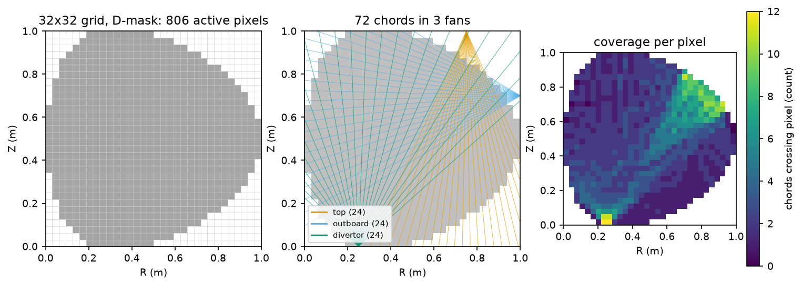

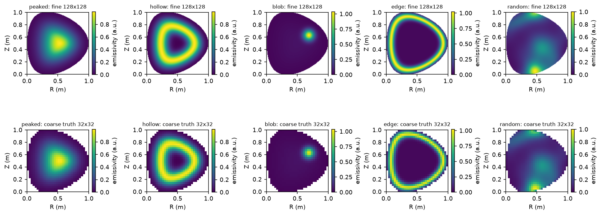

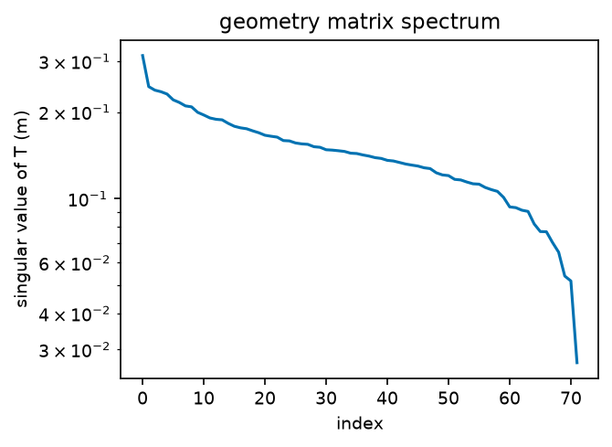

---

# M2 baselines

## M2 baselines

### Named phantoms (per phantom)

#### peaked

| method | rel_l2 | ssim | peak_err_cm | power_err | chi2_red | coverage68 | coverage95 | lam | time |
|---|---|---|---|---|---|---|---|---|---|
| tikhonov_gcv | 0.261 | 0.781 | 0 | 0.0115 | 0.00714 | - | - | 3.87 | 0.0194 |
| tikhonov_tuned | 0.289 | 0.776 | 0 | 0.00443 | 1 | - | - | 168 | 0.0165 |
| mfi | 0.2 | 0.836 | 0 | 0.0611 | 0.349 | - | - | 122 | 0.0879 |
| gp | 0.226 | 0.739 | 3.12 | 0.0773 | 1.03 | 0.277 | 0.542 | - | 1.72 |

#### hollow

| method | rel_l2 | ssim | peak_err_cm | power_err | chi2_red | coverage68 | coverage95 | lam | time |
|---|---|---|---|---|---|---|---|---|---|
| tikhonov_gcv | 0.649 | 0.351 | 57 | 0.163 | 0.0499 | - | - | 4.3 | 0.015 |
| tikhonov_tuned | 0.65 | 0.309 | 53.9 | 0.151 | 1 | - | - | 52 | 0.0142 |
| mfi | 0.807 | 0.207 | 57 | 0.213 | 0.34 | - | - | 43 | 0.0774 |
| gp | 0.54 | 0.504 | 53.5 | 0.11 | 0.793 | 0.455 | 0.708 | - | 1.93 |

#### blob

| method | rel_l2 | ssim | peak_err_cm | power_err | chi2_red | coverage68 | coverage95 | lam | time |
|---|---|---|---|---|---|---|---|---|---|
| tikhonov_gcv | 0.784 | 0.178 | 3.12 | 0.163 | 0.00386 | - | - | 9.36 | 0.0204 |
| tikhonov_tuned | 0.767 | 0.224 | 3.12 | 0.222 | 1 | - | - | 373 | 0.0192 |
| mfi | 0.41 | 0.673 | 3.12 | 0.123 | 0.376 | - | - | 638 | 0.11 |
| gp | 0.798 | 0.161 | 4.42 | 0.11 | 0.667 | 0.581 | 0.87 | - | 3.61 |

#### edge

| method | rel_l2 | ssim | peak_err_cm | power_err | chi2_red | coverage68 | coverage95 | lam | time |
|---|---|---|---|---|---|---|---|---|---|
| tikhonov_gcv | 0.604 | 0.376 | 20 | 0.0346 | 0.496 | - | - | 15.6 | 0.0273 |
| tikhonov_tuned | 0.597 | 0.375 | 20 | 0.0269 | 1 | - | - | 29.4 | 0.0473 |
| mfi | 0.62 | 0.458 | 89.5 | 0.0738 | 0.195 | - | - | 23 | 0.325 |
| gp | 0.653 | 0.34 | 20 | 0.0142 | 0.457 | 0.666 | 0.891 | - | 2.75 |

### Random fields (n=200): mean over fields

| method | rel_l2 | ssim | peak_err_cm | power_err | chi2_red | coverage68 | coverage95 |
|---|---|---|---|---|---|---|---|
| tikhonov_gcv | 0.336 | 0.658 | 17.8 | 0.0435 | 0.165 | - | - |
| tikhonov_tuned | 0.353 | 0.651 | 17 | 0.0475 | 1 | - | - |
| mfi | 0.296 | 0.723 | 16 | 0.0387 | 0.2 | - | - |
| gp | 0.291 | 0.718 | 14.1 | 0.0364 | 0.683 | 0.634 | 0.891 |

Median / std of rel-L2 over random fields:

| method | rel_l2_med | rel_l2_std | ssim_med | peak_err_cm_med |
|---|---|---|---|---|
| tikhonov_gcv | 0.327 | 0.0743 | 0.665 | 6.99 |
| tikhonov_tuned | 0.345 | 0.0713 | 0.656 | 6.99 |
| mfi | 0.289 | 0.0686 | 0.738 | 6.99 |
| gp | 0.279 | 0.0759 | 0.73 | 4.42 |

Best rel-L2 count over random fields: tikhonov_gcv=3, tikhonov_tuned=2, mfi=85, gp=110

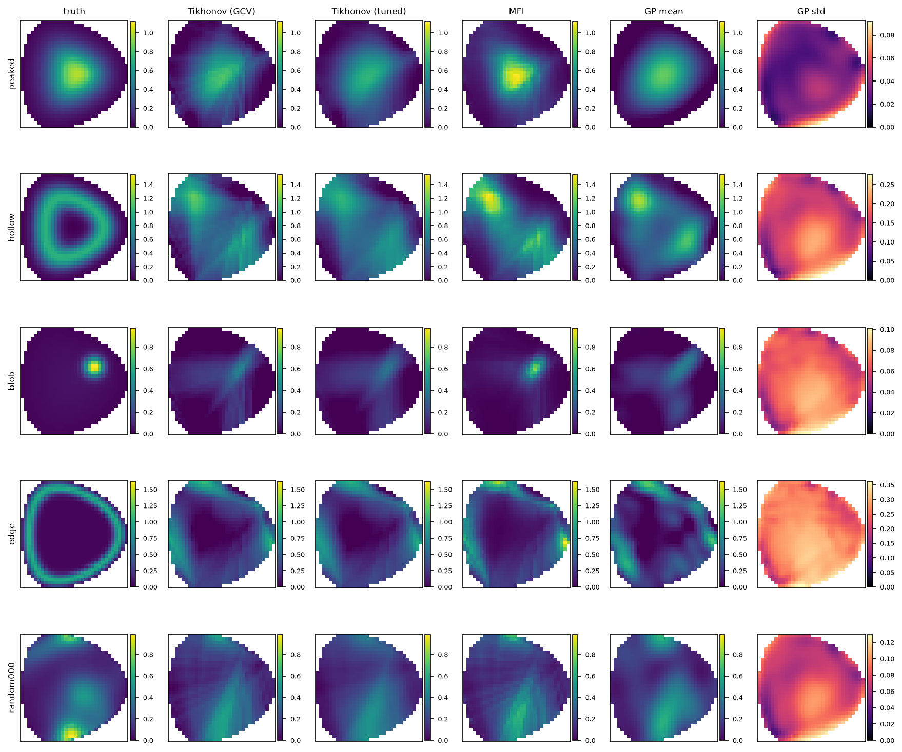

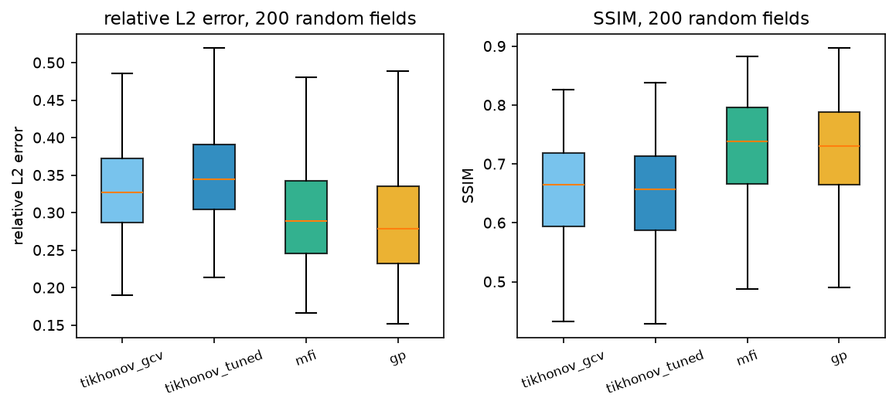

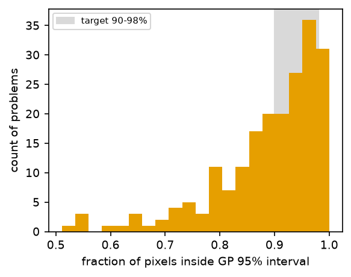

---

# M3 EBM comparison

## M3 EBM comparison

Variants: ['potts', 'dense', 'chain', 'tree']. Schedule: posterior {'n_warmup': 2000, 'n_samples': 500, 'steps_per_sample': 10}, 16 chains, anneal {'beta_min': 0.1, 'beta_max': 50.0, 'n_betas': 30, 'sweeps_per_beta': 20}, K=8.

**Subsampling:** EBM runs on the 4 phantoms + 8 random fields (m2 baselines use 200). Baselines in this table use the same problems and noise draws. `*_map` rows are the annealed MAP estimate. time_s = sampling+anneal time reported by the sampler; for potts/dense/sparse this excludes JIT compile, but for **chain** it includes model build, Tikhonov warm start and JIT compile (tomo/ebm_chain.py measures from function entry), so chain time_s is NOT comparable and overstates sampling cost.

### peaked

| method | rel_l2 | ssim | peak_err_cm | power_err | chi2_red | coverage68 | coverage95 | rhat_max | invalid_frac | n_spins | n_blocks | max_degree | time_s |
|---|---|---|---|---|---|---|---|---|---|---|---|---|---|
| tikhonov_gcv | 0.261 | 0.781 | 0 | 0.0115 | 0.00714 | - | - | - | - | - | - | - | - |
| tikhonov_tuned | 0.263 | 0.785 | 0 | 0.00939 | 0.0805 | - | - | - | - | - | - | - | - |
| mfi | 0.2 | 0.836 | 0 | 0.0611 | 0.349 | - | - | - | - | - | - | - | - |
| gp | 0.226 | 0.739 | 3.12 | 0.0773 | 1.03 | 0.277 | 0.542 | - | - | - | - | - | - |
| potts | 0.257 | 0.789 | 0 | 0.0467 | 0.356 | 0.797 | 0.98 | 1 | 0 | 806 | 48 | 364 | 29.9 |
| potts_map | 0.242 | 0.777 | 17.7 | 0.00559 | 0.121 | - | - | - | - | - | - | - | - |
| dense | 0.258 | 0.789 | 0 | 0.0467 | 0.358 | 0.797 | 0.979 | 1 | 0 | 5642 | 315 | 2554 | 57.1 |
| dense_map | 0.253 | 0.75 | 15.6 | 0.0151 | 0.194 | - | - | - | - | - | - | - | - |
| chain | 0.313 | 0.737 | 0 | 0.0586 | 7.25 | 0.785 | 0.983 | 26.5 | 0 | 74276 | 76 | 716 | 131 |
| chain_map | 0.483 | 0.487 | 12.9 | 0.078 | 6.52 | - | - | - | - | - | - | - | - |
| tree | 0.283 | 0.763 | 0 | 0.0476 | 3.45 | 0.806 | 0.983 | 7.52 | 0 | 72044 | 114 | 468 | 176 |
| tree_map | 0.405 | 0.576 | 9.88 | 0.0142 | 2.2 | - | - | - | - | - | - | - | - |

### hollow

| method | rel_l2 | ssim | peak_err_cm | power_err | chi2_red | coverage68 | coverage95 | rhat_max | invalid_frac | n_spins | n_blocks | max_degree | time_s |
|---|---|---|---|---|---|---|---|---|---|---|---|---|---|
| tikhonov_gcv | 0.649 | 0.351 | 57 | 0.163 | 0.0499 | - | - | - | - | - | - | - | - |
| tikhonov_tuned | 0.649 | 0.345 | 57 | 0.163 | 0.125 | - | - | - | - | - | - | - | - |
| mfi | 0.807 | 0.207 | 57 | 0.213 | 0.34 | - | - | - | - | - | - | - | - |
| gp | 0.54 | 0.504 | 53.5 | 0.11 | 0.793 | 0.455 | 0.708 | - | - | - | - | - | - |
| potts | 0.558 | 0.469 | 53.9 | 0.126 | 0.325 | 0.459 | 0.834 | 1 | 0 | 806 | 48 | 364 | 30.6 |
| potts_map | 0.689 | 0.331 | 25.8 | 0.161 | 0.261 | - | - | - | - | - | - | - | - |
| dense | 0.561 | 0.464 | 53.9 | 0.126 | 0.326 | 0.458 | 0.829 | 1 | 0 | 5642 | 315 | 2554 | 62.2 |
| dense_map | 0.67 | 0.335 | 44.7 | 0.169 | 0.246 | - | - | - | - | - | - | - | - |
| chain | 0.557 | 0.424 | 50.4 | 0.092 | 4.4 | 0.459 | 0.861 | 41.3 | 0 | 74276 | 76 | 716 | 149 |
| chain_map | 0.685 | 0.307 | 28.3 | 0.125 | 5.81 | - | - | - | - | - | - | - | - |
| tree | 0.549 | 0.459 | 53.9 | 0.108 | 2.15 | 0.48 | 0.836 | 6.16 | 0 | 72044 | 114 | 468 | 168 |
| tree_map | 0.585 | 0.398 | 39.5 | 0.0999 | 2.33 | - | - | - | - | - | - | - | - |

### blob

| method | rel_l2 | ssim | peak_err_cm | power_err | chi2_red | coverage68 | coverage95 | rhat_max | invalid_frac | n_spins | n_blocks | max_degree | time_s |
|---|---|---|---|---|---|---|---|---|---|---|---|---|---|
| tikhonov_gcv | 0.784 | 0.178 | 3.12 | 0.163 | 0.00386 | - | - | - | - | - | - | - | - |
| tikhonov_tuned | 0.776 | 0.188 | 3.12 | 0.175 | 0.0822 | - | - | - | - | - | - | - | - |
| mfi | 0.41 | 0.673 | 3.12 | 0.123 | 0.376 | - | - | - | - | - | - | - | - |
| gp | 0.798 | 0.161 | 4.42 | 0.11 | 0.667 | 0.581 | 0.87 | - | - | - | - | - | - |
| potts | 0.593 | 0.573 | 3.12 | 0.357 | 0.589 | 0.716 | 0.909 | 1 | 0 | 806 | 48 | 364 | 30.3 |
| potts_map | 0.627 | 0.409 | 6.99 | 0.143 | 0.198 | - | - | - | - | - | - | - | - |
| dense | 0.593 | 0.573 | 3.12 | 0.357 | 0.588 | 0.715 | 0.911 | 1 | 0 | 5642 | 315 | 2554 | 58.7 |
| dense_map | 0.593 | 0.438 | 6.99 | 0.152 | 0.241 | - | - | - | - | - | - | - | - |
| chain | 0.689 | 0.537 | 3.12 | 0.608 | 36 | 0.77 | 0.931 | 2.72e+14 | 0 | 74276 | 76 | 716 | 150 |
| chain_map | 0.701 | 0.365 | 74.5 | 0.0268 | 53.7 | - | - | - | - | - | - | - | - |
| tree | 0.636 | 0.562 | 3.12 | 0.551 | 17 | 0.782 | 0.929 | 3.4 | 0 | 72044 | 114 | 468 | 259 |
| tree_map | 0.775 | 0.334 | 4.42 | 0.474 | 10.7 | - | - | - | - | - | - | - | - |

### edge

| method | rel_l2 | ssim | peak_err_cm | power_err | chi2_red | coverage68 | coverage95 | rhat_max | invalid_frac | n_spins | n_blocks | max_degree | time_s |
|---|---|---|---|---|---|---|---|---|---|---|---|---|---|
| tikhonov_gcv | 0.604 | 0.376 | 20 | 0.0346 | 0.496 | - | - | - | - | - | - | - | - |
| tikhonov_tuned | 0.611 | 0.375 | 20 | 0.036 | 0.14 | - | - | - | - | - | - | - | - |
| mfi | 0.62 | 0.458 | 89.5 | 0.0738 | 0.195 | - | - | - | - | - | - | - | - |
| gp | 0.653 | 0.34 | 20 | 0.0142 | 0.457 | 0.666 | 0.891 | - | - | - | - | - | - |
| potts | 0.613 | 0.386 | 89.5 | 0.143 | 0.298 | 0.691 | 0.887 | 1 | 0 | 806 | 48 | 364 | 48.8 |
| potts_map | 0.647 | 0.369 | 91.1 | 0.0555 | 0.2 | - | - | - | - | - | - | - | - |
| dense | 0.613 | 0.387 | 89.5 | 0.143 | 0.297 | 0.691 | 0.887 | 1 | 0 | 5642 | 315 | 2554 | 110 |
| dense_map | 0.632 | 0.37 | 91.1 | 0.0588 | 0.228 | - | - | - | - | - | - | - | - |
| chain | 0.613 | 0.376 | 89.5 | 0.185 | 8.63 | 0.696 | 0.908 | inf | 0 | 74276 | 76 | 716 | 323 |
| chain_map | 0.761 | 0.251 | 75.1 | 0.188 | 13.4 | - | - | - | - | - | - | - | - |
| tree | 0.617 | 0.375 | 89.5 | 0.16 | 3.44 | 0.685 | 0.896 | 2.54 | 0 | 72044 | 114 | 468 | 454 |
| tree_map | 0.714 | 0.261 | 91.1 | 0.0835 | 1.67 | - | - | - | - | - | - | - | - |

### Random fields (n=8): mean over fields

| method | n | rel_l2 | ssim | peak_err_cm | power_err | chi2_red | coverage68 | coverage95 | rhat_max | time_s |
|---|---|---|---|---|---|---|---|---|---|---|
| tikhonov_gcv | 8 | 0.302 | 0.684 | 26.4 | 0.0201 | 0.161 | - | - | - | - |
| tikhonov_tuned | 8 | 0.303 | 0.685 | 15.1 | 0.0205 | 0.185 | - | - | - | - |
| mfi | 8 | 0.285 | 0.719 | 26.1 | 0.0225 | 0.0858 | - | - | - | - |
| gp | 8 | 0.263 | 0.744 | 23.6 | 0.0152 | 0.65 | 0.7 | 0.933 | - | - |
| potts | 8 | 0.308 | 0.685 | 17.1 | 0.0303 | 0.223 | 0.715 | 0.945 | 1 | 44.6 |
| potts_map | 8 | 0.332 | 0.58 | 19.4 | 0.0279 | 0.305 | - | - | - | - |
| dense | 8 | 0.307 | 0.686 | 17.9 | 0.0304 | 0.224 | 0.716 | 0.945 | 1 | 107 |
| dense_map | 8 | 0.336 | 0.585 | 19.2 | 0.0306 | 0.314 | - | - | - | - |
| chain | 8 | 0.321 | 0.67 | 17.1 | 0.0345 | 0.936 | 0.725 | 0.945 | 6.2e+14 | 249 |
| chain_map | 8 | 0.432 | 0.407 | 17.1 | 0.0285 | 2.08 | - | - | - | - |
| tree | 8 | 0.311 | 0.675 | 16.6 | 0.0299 | 0.444 | 0.697 | 0.941 | 3.85e+14 | 288 |
| tree_map | 8 | 0.407 | 0.451 | 18.2 | 0.0459 | 0.981 | - | - | - | - |

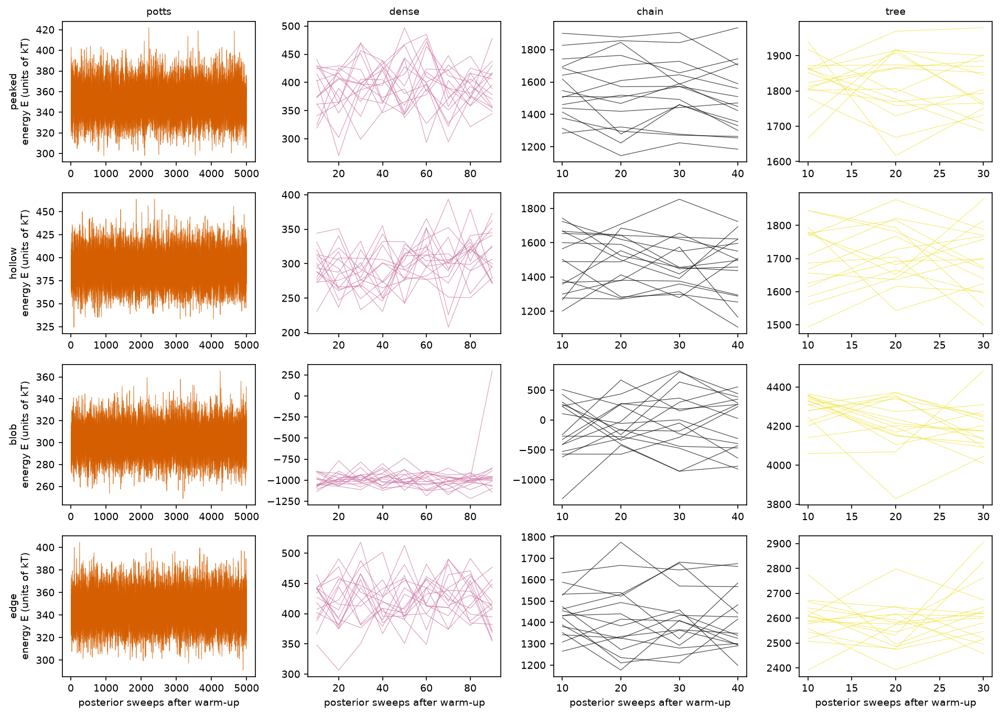

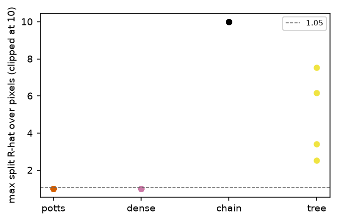

---

# M4 ablations

## M4 ablations

phantoms: ['peaked']; schedule: {'n_warmup': 2000, 'n_samples': 500, 'steps_per_sample': 10}, n_chains=16

### K

| K | problem | variant | rel_l2 | map_rel_l2 | coverage95 | rhat_max | invalid_frac | n_spins | n_blocks | time_s | error |
|---|---|---|---|---|---|---|---|---|---|---|---|
| 4 | peaked | potts | 0.322 | 0.453 | 0.857 | 1.01 | 0 | 806 | 48 | 23 | - |
| 4 | peaked | chain | 0.361 | 0.517 | 0.85 | 2.41e+14 | 0 | 71052 | 68 | 246 | - |
| 8 | peaked | potts | 0.258 | 0.276 | 0.98 | 1 | 0 | 806 | 48 | 35 | - |
| 8 | peaked | chain | 0.3 | 0.486 | 0.984 | 2.87e+14 | 0 | 74276 | 76 | 142 | - |
| 16 | peaked | potts | 0.278 | 0.23 | 0.984 | 1 | 0 | 806 | 48 | 59.6 | - |
| 16 | peaked | chain | 0.326 | 0.314 | 0.974 | 1.11 | 2.17e-06 | 80724 | 92 | 249 | - |

### tau

| tau | problem | variant | rel_l2 | map_rel_l2 | coverage95 | rhat_max | invalid_frac | n_spins | n_blocks | time_s | error |
|---|---|---|---|---|---|---|---|---|---|---|---|
| 0.1 | peaked | chain | 0.435 | 0.517 | 0.954 | 6.32e+14 | 0 | 74276 | 76 | 145 | - |
| 0.25 | peaked | chain | 0.395 | 0.419 | 0.85 | 7.29e+14 | 0 | 74276 | 76 | 142 | - |
| 0.5 | peaked | chain | 0.302 | 0.487 | 0.976 | 3.52e+14 | 0 | 74276 | 76 | 139 | - |
| 1 | peaked | chain | 0.337 | 0.382 | 0.978 | 3.91 | 0 | 74276 | 76 | 135 | - |
| 2 | peaked | chain | 0.434 | 0.465 | 0.945 | 1.09 | 9.31e-07 | 74276 | 76 | 137 | - |

### sparse

| threshold | problem | variant | rel_l2 | map_rel_l2 | coverage95 | rhat_max | invalid_frac | n_spins | n_blocks | time_s | error |
|---|---|---|---|---|---|---|---|---|---|---|---|
| 0.01 | peaked | sparse | 0.263 | 0.293 | 0.975 | 1 | 0 | 5642 | 231 | 51.9 | - |
| 0.02 | peaked | sparse | 0.27 | 0.295 | 0.967 | 1 | 0 | 5642 | 231 | 43.9 | - |
| 0.05 | peaked | sparse | 0.264 | 0.304 | 0.958 | 1 | 0 | 5642 | 196 | 27.5 | - |
| 0.1 | peaked | sparse | 0.26 | 0.323 | 0.963 | 1 | 0 | 5642 | 133 | 17.5 | - |
| 0.2 | peaked | sparse | 0.261 | 0.302 | 0.949 | 1 | 0 | 5642 | 49 | 9.14 | - |

### noise

| noise | problem | variant | rel_l2 | map_rel_l2 | coverage95 | rhat_max | invalid_frac | n_spins | n_blocks | time_s | error |
|---|---|---|---|---|---|---|---|---|---|---|---|
| 0.01 | peaked | tikhonov_tuned | 0.265 | - | - | - | - | - | - | - | - |
| 0.01 | peaked | potts | 0.239 | 0.226 | 0.979 | 1 | 0 | 806 | 48 | 30.7 | - |
| 0.01 | peaked | chain | 0.287 | 0.423 | 0.984 | 2.11e+14 | 0 | 74276 | 76 | 127 | - |
| 0.03 | peaked | tikhonov_tuned | 0.263 | - | - | - | - | - | - | - | - |
| 0.03 | peaked | potts | 0.258 | 0.273 | 0.979 | 1 | 0 | 806 | 48 | 31.4 | - |
| 0.03 | peaked | chain | 0.31 | 0.44 | 0.98 | 42.6 | 0 | 74276 | 76 | 134 | - |
| 0.05 | peaked | tikhonov_tuned | 0.263 | - | - | - | - | - | - | - | - |
| 0.05 | peaked | potts | 0.277 | 0.296 | 0.985 | 1 | 0 | 806 | 48 | 30.9 | - |
| 0.05 | peaked | chain | 0.328 | 0.472 | 0.985 | 24.4 | 0 | 74276 | 76 | 146 | - |
| 0.1 | peaked | tikhonov_tuned | 0.265 | - | - | - | - | - | - | - | - |
| 0.1 | peaked | potts | 0.325 | 0.254 | 0.984 | 1 | 0 | 806 | 48 | 31 | - |
| 0.1 | peaked | chain | 0.363 | 0.534 | 0.986 | 5.33 | 0 | 74276 | 76 | 137 | - |

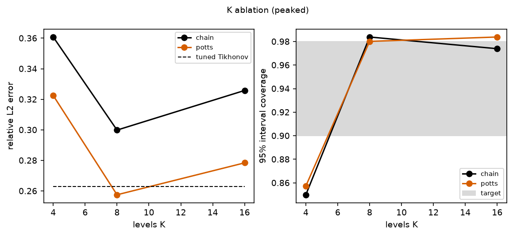

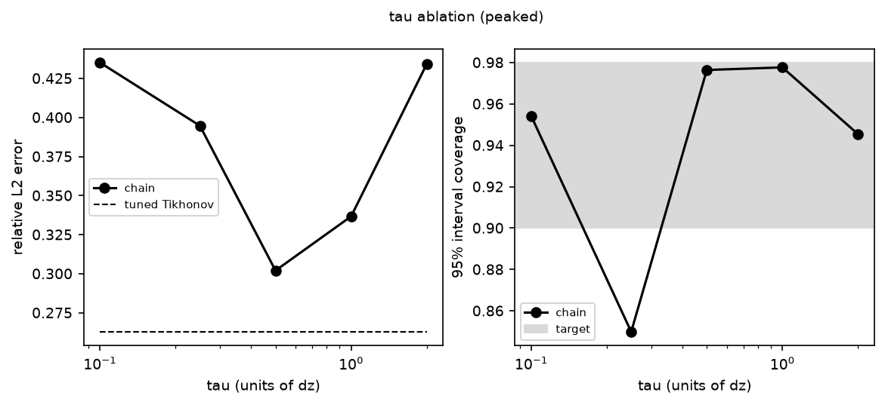

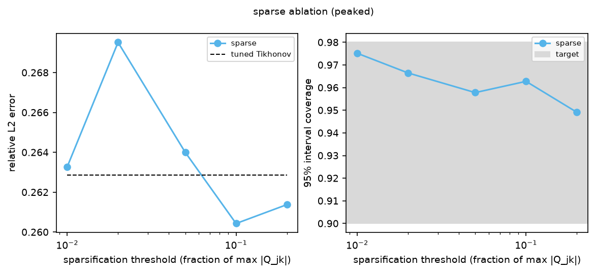

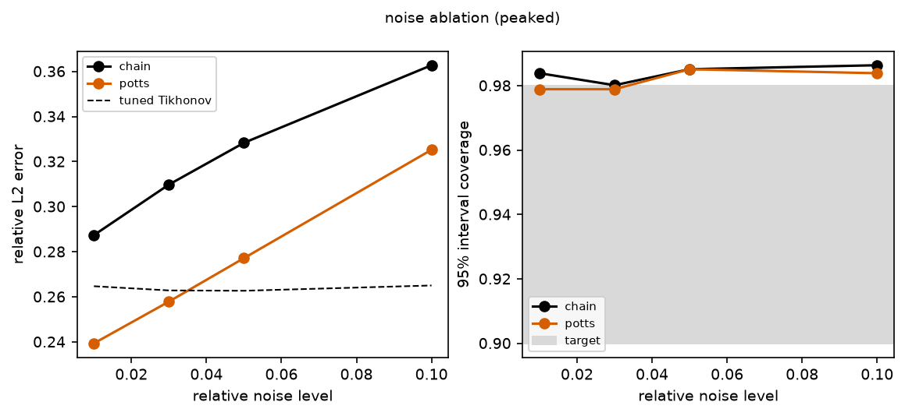

---

# M5 TSU energy

## TSU energy / latency estimates

Model (tomo/energy.py): E = N_spins x N_sweeps x N_chains x E_cell (E_cell = 1.3 fJ), t = N_sweeps x N_blocks x t_update (t_update = 100 ns; chains in parallel on separate chip area). These are assumptions, not measurements of TSU hardware.

> chain: not converged in all runs; using full schedule (7000 sweeps) -- not a converged-cost estimate.

> tree: not converged in all runs; using full schedule (7000 sweeps) -- not a converged-cost estimate.

| variant | task | n_spins | n_blocks | n_chains | sweeps | tsu_energy_J | tsu_latency_s | laptop_time_s | laptop_energy_J | gpu_energy_J | gpu_latency_s |
|---|---|---|---|---|---|---|---|---|---|---|---|
| chain | posterior | 7.43e+04 | 76 | 16 | 7000 | 1.08e-05 | 0.0532 | 213 | 4.27e+03 | 120 | 59.7 |
| chain | MAP anneal | 7.43e+04 | 76 | 16 | 600 | 9.27e-07 | 0.00456 | 18.3 | 366 | 10.3 | 5.12 |
| dense | posterior | 5.64e+03 | 315 | 16 | 2390 | 2.8e-07 | 0.0753 | 30.7 | 614 | 11 | 5.51 |
| dense | MAP anneal | 5.64e+03 | 315 | 16 | 600 | 7.04e-08 | 0.0189 | 7.7 | 154 | 2.77 | 1.38 |
| potts | posterior | 806 | 48 | 16 | 2300 | 3.86e-08 | 0.011 | 12.5 | 251 | 0.219 | 0.109 |
| potts | MAP anneal | 806 | 48 | 16 | 600 | 1.01e-08 | 0.00288 | 3.27 | 65.4 | 0.0571 | 0.0283 |
| tree | posterior | 7.2e+04 | 114 | 16 | 7000 | 1.05e-05 | 0.0798 | 269 | 5.38e+03 | 76.3 | 37.9 |
| tree | MAP anneal | 7.2e+04 | 114 | 16 | 600 | 8.99e-07 | 0.00684 | 23.1 | 461 | 6.54 | 3.25 |

Sweeps basis per variant:

- chain: 7000 sweeps -- full configured schedule (NOT converged in 100% of runs; value is a lower bound on cost to converge)
- dense: 2390 sweeps -- measured sweeps-to-converge (R-hat<1.05, median over runs) + warm-up
- potts: 2300 sweeps -- measured sweeps-to-converge (R-hat<1.05, median over runs) + warm-up
- tree: 7000 sweeps -- full configured schedule (NOT converged in 100% of runs; value is a lower bound on cost to converge)

### Laptop and GPU comparison

Laptop energy = measured wall time x CPU package power. Default power is an ASSUMED constant (--cpu-power-w, 20 W). For a measured value run, in a separate terminal during an m3 run: `sudo powermetrics --samplers cpu_power -i 200 > pm.log` and pass `--powermetrics-log pm.log` (parsed for 'CPU Power: N mW' lines; the mean is used). This script never runs sudo itself.

Caveat: the chain variant's measured time_s includes model build, Tikhonov warm start and JIT compile (the other variants exclude compile), so its laptop time/energy is an overestimate.

GPU: tomo.energy.gpu_mcmc_estimate (op-count model: 2*degree+10 flops/update, 1e-11 J/flop, 10 TFLOP/s peak at 10% efficiency, 400 GB/s memory); energy is flop-based (lower bound when memory bound). Laptop time apportioned between posterior and MAP by sweeps; spec spins/blocks for Potts count 'categorical' sites with K levels, so TSU numbers for Potts assume a (hypothetical) categorical sampler cell and are not hardware-faithful.

### Sensitivity (chain, posterior, 7000 sweeps, 16 chains)

| E_cell_factor | E_cell_J | t_update_s | energy_J | latency_s |
|---|---|---|---|---|
| 0.5 | 6.5e-16 | 5e-08 | 5.41e-06 | 0.0266 |
| 0.5 | 6.5e-16 | 1e-07 | 5.41e-06 | 0.0532 |
| 0.5 | 6.5e-16 | 5e-07 | 5.41e-06 | 0.266 |
| 1 | 1.3e-15 | 5e-08 | 1.08e-05 | 0.0266 |
| 1 | 1.3e-15 | 1e-07 | 1.08e-05 | 0.0532 |
| 1 | 1.3e-15 | 5e-07 | 1.08e-05 | 0.266 |
| 3 | 3.9e-15 | 5e-08 | 3.24e-05 | 0.0266 |
| 3 | 3.9e-15 | 1e-07 | 3.24e-05 | 0.0532 |
| 3 | 3.9e-15 | 5e-07 | 3.24e-05 | 0.266 |

### Hardware presets (tomo.energy.HARDWARE): logical vs embedded, with / without readout

- **spec**: Project spec: Extropic codon_opt figure 1.3 fJ per spin per Gibbs step (incl. RNG ~350 aJ, biasing, clocking, comms); t_update = 100 ns RNG decorrelation time per colour block.
- **extropic_2510**: Extropic arXiv:2510.23972 v2: E_cell ~ 2 fJ per cell, tau_0 ~ 100 ns (as quoted in docs/related_work.md; approximate, not re-verified against the paper text).
- **z1_2608**: Extropic arXiv:2608.01615 App. B, Table IV (SPICE-based, 50 MHz column): Gibbs update 7.09 fJ 'per pBIT node per Gibbs cycle at 50 MHz' (Sec. on the Z1 projection restates it as '7.09 fJ per p-bit per sweep, 20 ns sweeps, 25 us readout'); read 1.692 pJ per pBIT node; write (flash couplings/biases) 153.6 pJ per pBIT node; Z1 is a planar 2-colourable graph so one 20 ns cycle updates both colours (10 ns per colour block, derived). Their projection charges energy to sweeps only (readout excluded) and the 25 us readout is per frame readout.

Sweep counts are the posterior sweeps above (placeholders until convergence is measured). 'logical' rows use the unembedded spin/colour counts (not hostable on Z1: degree > 16); 'embedded' rows use the degree-16 copy-node embedded spin count and its greedy colour count; z1_2608 latency charges 20 ns per sweep only if the graph has <= 2 colours, otherwise 10 ns per colour block (flag not_2colourable). Readout = one full read of every physical node per chain, 25 us per frame.

| variant | preset | layout | readout | n_spins | n_blocks | n_sweeps | energy_J | latency_s | not_2colourable |
|---|---|---|---|---|---|---|---|---|---|
| chain | spec | logical | False | 7.43e+04 | 76 | 7000 | 1.08e-05 | 0.0532 | False |
| chain | spec | embedded | False | 620967 | 17 | 7000 | 9.04e-05 | 0.0119 | False |
| chain | spec | logical | True | 7.43e+04 | 76 | 7000 | 1.08e-05 | 0.0532 | False |
| chain | spec | embedded | True | 620967 | 17 | 7000 | 9.04e-05 | 0.0119 | False |
| chain | extropic_2510 | logical | False | 7.43e+04 | 76 | 7000 | 1.66e-05 | 0.0532 | False |
| chain | extropic_2510 | embedded | False | 620967 | 17 | 7000 | 0.000139 | 0.0119 | False |
| chain | extropic_2510 | logical | True | 7.43e+04 | 76 | 7000 | 1.66e-05 | 0.0532 | False |
| chain | extropic_2510 | embedded | True | 620967 | 17 | 7000 | 0.000139 | 0.0119 | False |
| chain | z1_2608 | logical | False | 7.43e+04 | 76 | 7000 | 5.9e-05 | 0.00532 | True |
| chain | z1_2608 | embedded | False | 620967 | 17 | 7000 | 0.000493 | 0.00119 | True |
| chain | z1_2608 | logical | True | 7.43e+04 | 76 | 7000 | 6.1e-05 | 0.00534 | True |
| chain | z1_2608 | embedded | True | 620967 | 17 | 7000 | 0.00051 | 0.00122 | True |
| dense | spec | logical | False | 5.64e+03 | 315 | 2390 | 2.8e-07 | 0.0753 | False |
| dense | spec | embedded | False | 214207 | 17 | 2390 | 1.06e-05 | 0.00406 | False |
| dense | spec | logical | True | 5.64e+03 | 315 | 2390 | 2.8e-07 | 0.0753 | False |
| dense | spec | embedded | True | 214207 | 17 | 2390 | 1.06e-05 | 0.00406 | False |
| dense | extropic_2510 | logical | False | 5.64e+03 | 315 | 2390 | 4.32e-07 | 0.0753 | False |
| dense | extropic_2510 | embedded | False | 214207 | 17 | 2390 | 1.64e-05 | 0.00406 | False |
| dense | extropic_2510 | logical | True | 5.64e+03 | 315 | 2390 | 4.32e-07 | 0.0753 | False |
| dense | extropic_2510 | embedded | True | 214207 | 17 | 2390 | 1.64e-05 | 0.00406 | False |
| dense | z1_2608 | logical | False | 5.64e+03 | 315 | 2390 | 1.53e-06 | 0.00753 | True |
| dense | z1_2608 | embedded | False | 214207 | 17 | 2390 | 5.81e-05 | 0.000406 | True |
| dense | z1_2608 | logical | True | 5.64e+03 | 315 | 2390 | 1.68e-06 | 0.00755 | True |
| dense | z1_2608 | embedded | True | 214207 | 17 | 2390 | 6.39e-05 | 0.000431 | True |
| potts | spec | logical | False | 806 | 48 | 2300 | 3.86e-08 | 0.011 | False |
| potts | spec | logical | True | 806 | 48 | 2300 | 3.86e-08 | 0.011 | False |
| potts | extropic_2510 | logical | False | 806 | 48 | 2300 | 5.93e-08 | 0.011 | False |
| potts | extropic_2510 | logical | True | 806 | 48 | 2300 | 5.93e-08 | 0.011 | False |
| potts | z1_2608 | logical | False | 806 | 48 | 2300 | 2.1e-07 | 0.0011 | True |
| potts | z1_2608 | logical | True | 806 | 48 | 2300 | 2.32e-07 | 0.00113 | True |
| tree | spec | logical | False | 7.2e+04 | 114 | 7000 | 1.05e-05 | 0.0798 | False |
| tree | spec | embedded | False | 190889 | 17 | 7000 | 2.78e-05 | 0.0119 | False |
| tree | spec | logical | True | 7.2e+04 | 114 | 7000 | 1.05e-05 | 0.0798 | False |
| tree | spec | embedded | True | 190889 | 17 | 7000 | 2.78e-05 | 0.0119 | False |
| tree | extropic_2510 | logical | False | 7.2e+04 | 114 | 7000 | 1.61e-05 | 0.0798 | False |
| tree | extropic_2510 | embedded | False | 190889 | 17 | 7000 | 4.28e-05 | 0.0119 | False |
| tree | extropic_2510 | logical | True | 7.2e+04 | 114 | 7000 | 1.61e-05 | 0.0798 | False |
| tree | extropic_2510 | embedded | True | 190889 | 17 | 7000 | 4.28e-05 | 0.0119 | False |
| tree | z1_2608 | logical | False | 7.2e+04 | 114 | 7000 | 5.72e-05 | 0.00798 | True |
| tree | z1_2608 | embedded | False | 190889 | 17 | 7000 | 0.000152 | 0.00119 | True |
| tree | z1_2608 | logical | True | 7.2e+04 | 114 | 7000 | 5.92e-05 | 0.00801 | True |
| tree | z1_2608 | embedded | True | 190889 | 17 | 7000 | 0.000157 | 0.00122 | True |

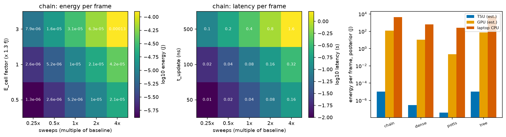
